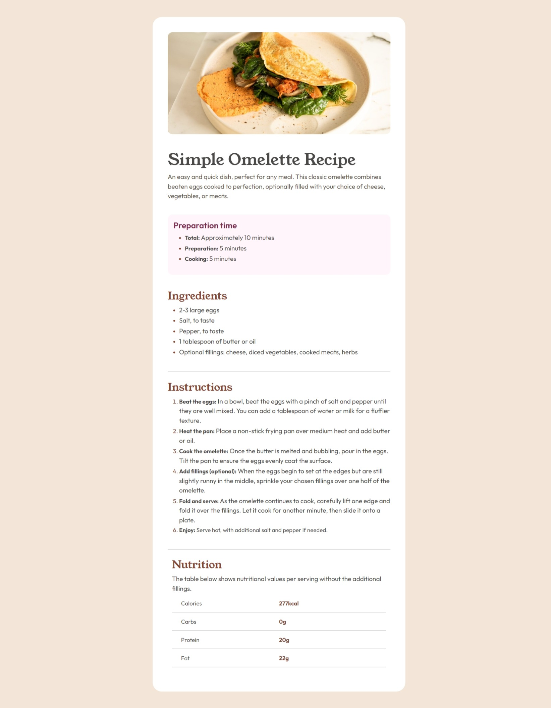

# Frontend Mentor - Recipe page solution

This is a solution to the [Recipe page challenge on Frontend Mentor](https://www.frontendmentor.io/challenges/recipe-page-KiTsR8QQKm). Frontend Mentor challenges help you improve your coding skills by building realistic projects. 

## Table of contents

- [Overview](#overview)
  - [The challenge](#the-challenge)
  - [Screenshot](#screenshot)
  - [Links](#links)
- [My process](#my-process)
  - [Built with](#built-with)
  - [What I learned](#what-i-learned)
  - [Continued development](#continued-development)
  - [Useful resources](#useful-resources)
- [Author](#author)
- [Acknowledgments](#acknowledgments)

**Note: Delete this note and update the table of contents based on what sections you keep.**

## Overview

  ### Screenshot
    

  ### Links

- Solution URL: [Add solution URL here](https://your-solution-url.com)
- Live Site URL: [Add live site URL here](https://your-live-site-url.com)

## My process

  ### Built with

    - Semantic HTML5 markup
    - CSS custom properties
    - Flexbox
    - CSS Grid
    - Mobile-first workflow
    - [Boostrap](https://boostrap.org/) - JS library


  ### What I learned

While working on this project, I learned how to implement responsive layouts using Bootstrap's grid system. It made creating a mobile-first design much easier.

```html
<body class="p-md-5">
</body>
```


  ### Continued development

While working on this project, I started learning Bootstrap, and I’ve realized how powerful it is for building responsive, mobile-first websites quickly. However, I’m not fully comfortable with all its components yet, and there’s still much for me to explore.


  ### Useful resources

<body class="p-md-5"> – This Bootstrap utility class was particularly useful in adding padding only on medium and larger screens. It allowed me to create a layout that looks cleaner on bigger devices without affecting smaller screens. I'll definitely use this technique in future projects for responsive spacing.


## Author

- Frontend Mentor - [@AlaranUmar](https://www.frontendmentor.io/profile/yourusername)


## Acknowledgments


